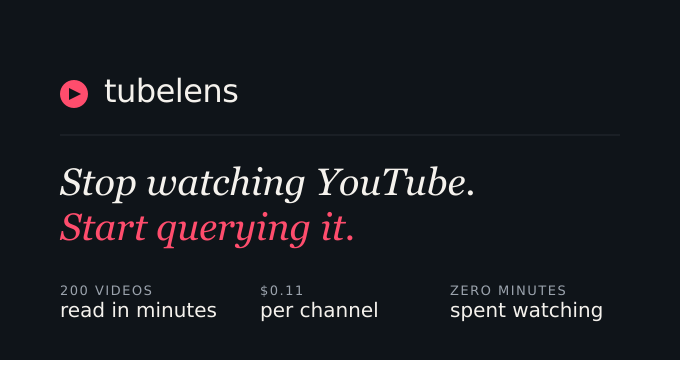
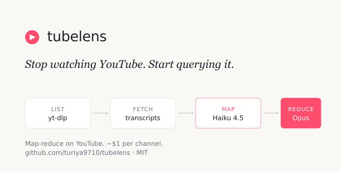
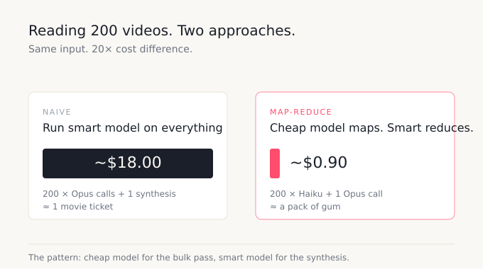

# tubelens

<p align="center">
  
</p>

> **Stop Watching YouTube. Start Querying It.**

Absorb an entire YouTube channel — every video and short — in minutes, without watching a single second.

`tubelens` pulls transcripts from a whole channel, summarizes each video with a cheap model, then synthesizes everything into a thematic overview using a smart model. The result is a structured document that tells you what the creator actually argues, what frameworks they use, where they contradict themselves, and how their views have evolved over time.

```
$ python tubelens.py "https://www.youtube.com/@hubermanlab" --limit 50
[list] found 50 videos total
[transcripts]: 100%|████████████| 50/50 [00:42<00:00]
[summaries]:   100%|████████████| 48/48 [03:17<00:00]
[reduce] synthesizing chunk 1/1 with claude-opus-4-7
[done] wrote channel_synthesis.md
```

---

## Quick Start

For people who just want to run it.

### 1. Install

```bash
git clone https://github.com/turiya9710/tubelens.git
cd tubelens
```

Create a virtual environment so `tubelens` dependencies stay isolated from your system Python:

```bash
python3 -m venv .venv
```

Activate it — **the command depends on your shell**:

```bash
source .venv/bin/activate          # bash / zsh (macOS/Linux default)
source .venv/bin/activate.csh      # tcsh / csh
source .venv/bin/activate.fish     # fish
.venv\Scripts\activate.bat         # Windows cmd
.venv\Scripts\Activate.ps1         # Windows PowerShell
```

> If you see `Badly placed ()'s.` you're in tcsh/csh — use the `.csh` variant above. The default `activate` script is bash-syntax and can't be sourced by csh-family shells.

Install dependencies:

```bash
pip install -r requirements.txt
```

When you're done with a session, `deactivate` exits the venv. Re-activate with the same command above next time.

### 2. Set your API key

`tubelens` reads `ANTHROPIC_API_KEY` from a `.env` file in the project root. **Don't paste the key into your shell history or commit it to git.**

Create `.env`:

```bash
cp .env.example .env
```

Open `.env` in your editor and paste your key:

```
ANTHROPIC_API_KEY=sk-ant-...
```

Get one at [console.anthropic.com](https://console.anthropic.com). You'll need credits — see [Cost](#cost-breakdown) below.

`.env` is already listed in `.gitignore`, so it won't be committed. Verify with `git status` before your first push.

> **Why `.env` and not `export`?**
> An `export` command lives in your shell history (`~/.bash_history`, `~/.zsh_history`) in plain text. A `.env` file stays out of version control and out of shell history. For team or CI use, swap `.env` for your platform's secret manager (GitHub Actions secrets, AWS Secrets Manager, Azure Key Vault, etc.).

### 3. Run

```bash
python tubelens.py "https://www.youtube.com/@channelname"
```

Output lands in `<channelhandle>_top<N>_result.md` (e.g. `chamath_top4_result.md`, `hubermanlab_top20_result.md`). Running with `--limit 0` produces `<handle>_all_result.md`. Open in any markdown viewer.

**Default behavior:** processes up to 20 most recent videos, skips shorts, uses Claude Sonnet 4.6 for the synthesis. These defaults are tuned for fast, cheap first runs — under $0.10 for most channels. Override anything below.

### Common flags

```bash
--limit 0              # process the whole channel (default: 20 most recent)
--include-shorts       # include /shorts (default: skipped)
--output custom.md     # custom output filename (default: <handle>_top<N>_result.md or <handle>_all_result.md)
--reduce-model opus    # use Opus 4.7 for highest-quality synthesis (default: sonnet, ~5x cheaper)
```

That's it. Skip to [Examples](#example-output) to see what you get.

---

## Deep Dive

For people who want to understand and customize.

### How it works

<p align="center">
  
</p>

```
┌─────────────────────────────────────────────────────────────────┐
│                      tubelens pipeline                          │
└─────────────────────────────────────────────────────────────────┘

  Channel URL
      │
      ▼
  ┌──────────────────────────────────────────────────────────┐
  │ 1. LIST       yt-dlp --flat-playlist                     │
  │               (no downloads — just enumerate IDs)        │
  │               /videos tab + /shorts tab                  │
  └──────────────────────────────────────────────────────────┘
      │  N video metadata records
      ▼
  ┌──────────────────────────────────────────────────────────┐
  │ 2. FETCH      youtube-transcript-api (parallel, 8 threads)│
  │               Prefers manual captions over auto-generated │
  │               Cached to .channel_cache/<id>.json          │
  └──────────────────────────────────────────────────────────┘
      │  N transcripts (some may be empty if captions disabled)
      ▼
  ┌──────────────────────────────────────────────────────────┐
  │ 3. MAP        Claude Haiku 4.5 (parallel, 4 threads)     │
  │               Per-video structured summary               │
  │               Prompt-cached prefix → 90% discount        │
  │               Cached to .channel_cache/<id>.summary.txt  │
  └──────────────────────────────────────────────────────────┘
      │  N structured summaries (THESIS / CLAIMS / MODELS / TOPICS)
      ▼
  ┌──────────────────────────────────────────────────────────┐
  │ 4. REDUCE     Claude Opus 4.7 (single call, or chunked)  │
  │               8-section thematic synthesis               │
  │               Auto-chunks if total > ~150k tokens        │
  └──────────────────────────────────────────────────────────┘
      │
      ▼
  <handle>_top<N>_result.md  (or <handle>_all_result.md with --limit 0)
```

**Why this shape:** the map step is high-volume but easy (just summarize one video), so it runs on the cheapest model with caching. The reduce step is low-volume but hard (find patterns across hundreds of summaries), so it runs on a stronger model. This is the standard map-reduce pattern adapted for LLMs.

**Why caching matters:** every step writes to `.channel_cache/`. Re-running with a tweaked synthesis prompt costs almost nothing — only the reduce step re-executes. Iterating on the prompt becomes effectively free.

### Cost breakdown

<p align="center">
  
</p>

**Default run (20 videos, Sonnet for reduce):**

| Step    | Model        | Cost          | Notes                                          |
| ------- | ------------ | ------------- | ---------------------------------------------- |
| List    | (yt-dlp)     | $0.00         | Local, no API                                  |
| Fetch   | (transcript) | $0.00         | Local, no API                                  |
| Map     | Haiku 4.5    | ~$0.03–0.05   | 20 videos, prompt caching active               |
| Reduce  | Sonnet 4.6   | ~$0.05–0.10   | Single call                                    |
| **Total** |            | **~$0.10**    | Most channels' first run lands here            |

**Full channel run (`--limit 0`, ~200 videos, Opus for reduce):**

| Step    | Model        | Cost          |
| ------- | ------------ | ------------- |
| Map     | Haiku 4.5    | ~$0.30–0.50   |
| Reduce  | Opus 4.7     | ~$0.30–0.50   |
| **Total** |            | **~$0.60–1.00** |

Re-runs (after editing the synthesis prompt) cost only the reduce step — typically $0.05–0.50 depending on model.


**Token math, simplified:**
- Map step: `N × (~150 tokens prompt + ~6,000 tokens transcript + ~250 tokens output)`. The static prompt prefix is cached, billing at ~10% of normal input rate after the first call.
- Reduce step: `~600 chars × N summaries ≈ 30k tokens input + 4k tokens output`. Single call (or chunked for very large channels).

**More expensive scenarios:**
- Channels with very long videos (1hr+ podcasts): map cost scales linearly with transcript length. Consider lowering `TRANSCRIPT_TRUNCATE` in the script.
- Huge channels (500+ videos) trigger the chunked reduce + merge pass. Adds maybe $0.50.

### Example output

A run on a hypothetical productivity channel produces a `channel_synthesis.md` like:

```markdown
1. CHANNEL THESIS
This channel argues that productivity is fundamentally a problem of attention
management, not time management. The creator combines cognitive science
research with personal experimentation to challenge mainstream "hustle"
narratives, advocating instead for deep work, deliberate rest, and systems
thinking applied to personal workflows.

2. TOP RECURRING THEMES
- Deep work vs shallow work (appears in ~40% of videos): the distinction
  between focused, cognitively demanding work and reactive busywork...
- Energy management over time management (~30%): sleep, nutrition, and
  exercise as productivity infrastructure...
- The myth of multitasking (~20%): citing Sophie Leroy's "attention residue"
  research repeatedly...
[...]

3. CORE MENTAL MODELS
- "Attention is the substrate of thought" — recurring framing where focus
  is treated as the limiting reagent
- Two-list system (priorities vs everything else)
- Energy as a renewable resource that requires deliberate replenishment
[...]

4. STRONGEST SPECIFIC CLAIMS
- "Switching tasks costs 23 minutes of refocus time on average" — cited
  in 4 different videos, attributed to UC Irvine research
- "I cut my email checks from 30/day to 3/day and shipped 2x more code"
  — personal experiment from "My Productivity Stack 2024"
[...]

5. EVOLUTION OVER TIME
Earlier videos (2021-2022) focused heavily on tools and apps (Notion, Roam,
Obsidian). Pivoted around mid-2023 toward systems and habits, with a
notable skepticism toward tool-switching that wasn't present earlier...

6. CONTRADICTIONS OR TENSIONS
- Advocates "single-tasking" but features productivity stacks involving
  6+ apps in workflow videos
- Says "outputs over inputs" repeatedly but tracks input metrics
  (hours read, courses completed) in self-reviews
[...]

7. WHAT'S MISSING
For a channel about productivity, surprising silence on:
- Compensation/career strategy as a productivity multiplier
- Team productivity (everything is solo-creator framed)
[...]

8. WHO SHOULD WATCH
Knowledge workers and solo creators looking for evidence-backed alternatives
to mainstream productivity advice, comfortable with reading-heavy "thinking
out loud" videos rather than tactical tutorials.
```

The format is consistent across any channel because the synthesis prompt enforces it. Run it on a finance channel and you'll get the same eight sections, just with different content.

### Customizing the synthesis prompt

This is the highest-leverage knob. The synthesis prompt lives in `tubelens.py` as `REDUCE_PROMPT`. The default extracts thesis / themes / mental models / claims / evolution / contradictions / gaps / audience.

**You can replace any section with what you actually want.** Examples:

- For a finance channel:
  > "Add a section: PORTFOLIO ALLOCATIONS the creator has actually recommended, with dates, and whether they've reversed any positions."

- For a self-help channel:
  > "Add a section: CONCRETE PROTOCOLS — every actionable practice the creator has prescribed, grouped by domain (sleep, focus, social), with dosage/duration where specified."

- For a tech channel:
  > "Add a section: TOOLS / FRAMEWORKS / PEOPLE referenced more than once, with frequency counts. Flag which ones the creator endorses vs criticizes vs just mentions."

- For a political/news channel:
  > "Add a section: FACTUAL CLAIMS that could be fact-checked, separated from opinion. Flag any claims that appear to contradict mainstream sources."

Edit `REDUCE_PROMPT`, re-run with `--reduce-model sonnet` for cheap iteration, then switch to `opus` for the final pass. The map cache ensures only the reduce step re-runs.

**You can also customize the map prompt** (`MAP_INSTRUCTIONS` in the script) to extract different per-video signals. If you change the map prompt, delete `.channel_cache/*.summary.txt` to force re-summarization.

### Caveats

- **Auto-generated captions are noisy.** Filler words, mishears on jargon and proper nouns. The synthesis is robust to this in aggregate but individual claims may be slightly garbled. For channels with manual captions (rare but some creators do this), quality jumps significantly.
- **Some videos disable captions entirely.** They're skipped. Typically <10% of a channel.
- **Music-heavy or visual-heavy channels won't work well** — if the value is in the visuals, transcripts capture little. Don't run this on a cooking channel and expect recipes.
- **Whisper fallback isn't built in yet** but is on the roadmap. Would let you process channels without captions at the cost of audio downloads + Whisper API.

### Roadmap

Things I'd add as this gets used more:

- `--since YYYY-MM-DD` / `--until YYYY-MM-DD` — synthesize a specific time window. Useful for tracking how a creator's views shifted in a particular period.
- `--query "..."` — RAG over the transcript corpus instead of producing a synthesis. ("Has this creator ever discussed X? With what conclusion?")
- Whisper fallback for videos with no captions.
- Multi-channel comparison — run on 3 channels covering the same topic, get a synthesis of where they agree and disagree.
- HTML output with collapsible per-video summaries linked to the synthesis.
- Lightweight web UI for non-developers.
- Playlist support (currently channel-only — playlists work the same way under the hood).

PRs welcome. Keep them focused — small, surgical changes preferred.

### License

MIT. See `LICENSE`.

### Acknowledgments

Built on top of:
- [yt-dlp](https://github.com/yt-dlp/yt-dlp) — the tireless YouTube extraction toolkit
- [youtube-transcript-api](https://github.com/jdepoix/youtube-transcript-api) — clean transcript fetching
- [Anthropic Claude](https://www.anthropic.com/) — Haiku 4.5 for map, Opus 4.7 for reduce